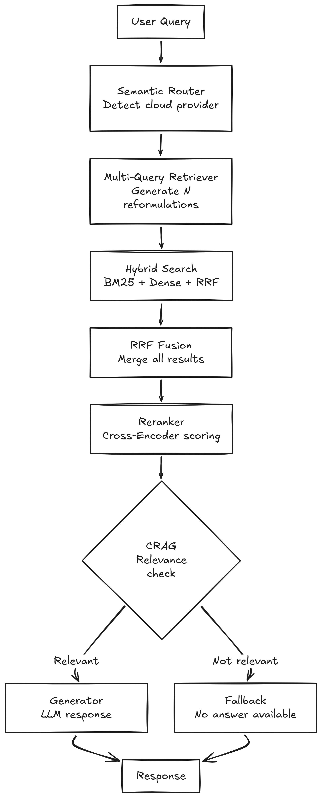
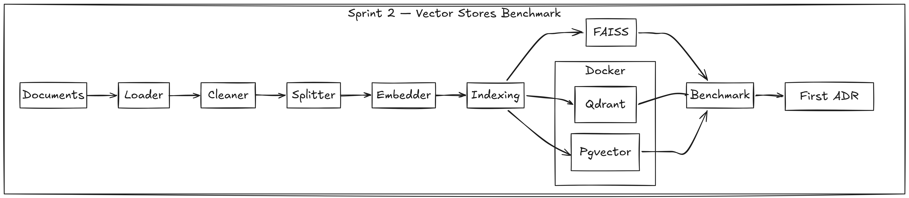

# CloudMind RAG

> Prescriptive RAG system for FinOps optimization in Multi-cloud architectures.

## Overview

CloudMind is an Advanced RAG pipeline that helps teams make informed decisions
about their cloud infrastructure by querying official documentation, best practices,
and FinOps data from AWS, Azure, GCP and compliance sources.

## Sprint 3 — Advanced RAG (Current)

### What's implemented

- Hybrid Search — BM25 + Dense + RRF fusion
- Cross-Encoder Reranker (BAAI/bge-reranker-v2-m3)
- Multi-Query RAG-Fusion (llama3.2:1b for reformulations)
- Semantic Router — embedding-based provider detection
- CRAG — Corrective RAG with relevance threshold and fallback
- LangSmith observability — full pipeline tracing
- Integration tests — 15/15 Advanced RAG components
- ADR 002 — Advanced RAG architecture decisions

### Observed Latency

| Component | Latency |
|---|---|
| SemanticRouter | ~50ms |
| MultiQuery (llama3.2:1b) | 1-8s |
| Reranker (bge-reranker-v2-m3) | ~2-5s |
| Generator (qwen3.5:9b) | ~60-70s |
| CRAG fallback (no LLM) | ~0.36s |

## Architecture — Sprint 3


---

## Sprint 2 — Vector Stores Benchmark

### What's implemented

- Qdrant vector store with cosine similarity and automatic persistence
- Pgvector vector store with HNSW index on PostgreSQL
- Docker Compose infrastructure (Qdrant + Pgvector)
- Pydantic Settings for environment configuration
- Pydantic + YAML config for technical parameters
- Integration tests for all three vector stores
- Full benchmark script (indexing, search, P95 latency, throughput)
- ADR 001 — Qdrant selected as production vector store

### Benchmark Results

| Store | Indexing | Avg Search | P95 Latency | Throughput | Similarity |
|---|---|---|---|---|---|
| FAISS | 0.23s | 0.003s | 0.0003s | 3603 QPS | 0.755 |
| **Qdrant**  | 11.18s | 0.182s | 0.033s | 54.9 QPS | 0.755 |
| Pgvector | 24.22s | 0.514s | 0.060s | 19.45 QPS | 0.755 |

> **Qdrant** selected for production — best balance between performance, persistence and metadata filtering.

## Architecture — Sprint 2


---

## Project Structure

```
backend/
├── src/
│   ├── loaders/         # PDF, Markdown, CSV loaders
│   ├── preprocessing/   # Text cleaner + splitter
│   ├── embeddings/      # Embedder
│   ├── vectorstores/    # FAISS + Qdrant + Pgvector
│   ├── rag/             # Retriever + HybridRetriever + MultiQuery + CRAG + Pipeline
│   ├── llm/             # Generator + Prompts
│   └── utils/           # Settings + Config
├── config/              # config.yaml
├── data/raw/
│   ├── cloud_docs/aws/
│   ├── cloud_docs/azure/
│   ├── cloud_docs/gcp/
│   └── cloud_docs/compliance/
├── data/benchmark/      # queries.json
├── results/benchmarks/  # benchmark results
├── scripts/             # benchmark scripts
├── tests/unit/
├── tests/integration/
└── notebooks/
```

## Installation

```bash
git clone https://github.com/Massi-Belharet/CloudMind-RAG.git
cd CloudMind-RAG
uv sync
docker compose up -d
```

## Models Required

```bash
ollama pull qwen3.5:9b      # Generator
ollama pull llama3.2:1b     # Multi-Query reformulation
```