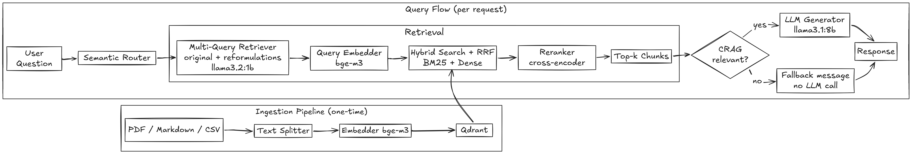

# CloudMind RAG

> Prescriptive RAG system for FinOps optimization in multi-cloud architectures.

CloudMind is an Advanced RAG pipeline that helps teams make informed decisions
about their cloud infrastructure by querying official documentation, best
practices, and FinOps data from AWS, Azure, GCP, and compliance sources
(GDPR/RGPD, EU Cloud Code of Conduct, ISO 27001).

## Architecture



*(Diagram details the full request flow: semantic provider routing, hybrid
search — BM25 + dense + RRF, multi-query RAG-Fusion, cross-encoder reranking,
CRAG relevance gating, and streamed generation.)*

## Tech Stack

| Layer | Technology |
|---|---|
| Language / package manager | Python 3.13, [uv](https://docs.astral.sh/uv/) |
| Vector store | [Qdrant](https://qdrant.tech/) (production) — see [ADR 001](docs/adr/001-vector-store-choice.md) |
| Embedding model | `BAAI/bge-m3` (1024-dim, fp16) — see [ADR 003](docs/adr/003-embedding-model-choice.md) |
| Reranker | `BAAI/bge-reranker-v2-m3` (cross-encoder) |
| Generation LLM | `llama3.1:8b` (via Ollama) |
| Multi-Query reformulation LLM | `llama3.2:1b` (via Ollama) |
| Backend framework | FastAPI + Uvicorn, streamed responses (SSE) |
| Frontend framework | React 19 + Vite, ChatGPT-style multi-conversation UI |
| Observability | LangSmith (full pipeline tracing) |
| Infrastructure | Docker Compose — Qdrant, Pgvector, backend (GPU), frontend (nginx) |

Retrieval defaults (`backend/config/config.yaml`): chunk size 500 (50 overlap),
top-k 5, CRAG relevance threshold `0.0129`, semantic router threshold
`0.5987` — both calibrated empirically (see `backend/scripts/calibrate_*.py`).

## Project Structure

```
backend/
├── src/
│   ├── api/             # FastAPI app, routes, dependency injection, one-shot index builder
│   ├── loaders/          # PDF, Markdown, CSV loaders
│   ├── preprocessing/    # Text cleaner + splitter
│   ├── embeddings/       # Embedder (bge-m3)
│   ├── vectorstores/     # Qdrant (production) + FAISS + Pgvector
│   ├── rag/              # Retriever, HybridRetriever, MultiQueryRetriever,
│   │                     # SemanticRouter, Reranker, Pipeline (CRAG)
│   ├── llm/               # Generator (streaming) + prompts
│   └── utils/            # Settings (.env) + Config (config.yaml)
├── config/                # config.yaml
├── data/
│   ├── raw/cloud_docs/    # aws/ azure/ gcp/ compliance/ source documents
│   └── benchmark/         # Evaluation queries + ground truth
├── results/benchmarks/    # Benchmark & calibration outputs
├── scripts/                # Benchmarks, RAGAS evaluation, threshold calibration
├── tests/unit/             # Unit tests (mocked dependencies)
├── tests/integration/      # Integration tests (real models/infra)
└── notebooks/              # Exploratory notebooks

frontend/
└── src/
    ├── components/         # Message, ChatInput, Sidebar
    ├── App.jsx             # Conversation state, streaming orchestration
    ├── api.js              # Backend HTTP/SSE client
    └── storage.js          # localStorage persistence

deployments/docker/         # Dockerfiles (backend, frontend, GPU smoke test) + guide
docs/
├── adr/                    # Architecture Decision Records
└── diagrams/                # Architecture diagrams
```

## Installation & Prerequisites

- **Python 3.13** with [uv](https://docs.astral.sh/uv/)
- **Node.js** with npm
- **Docker** (with GPU passthrough support for the Docker method)
- **[Ollama](https://ollama.com/)**, running natively on the host, with the models used by `config.yaml`:

```bash
ollama pull llama3.1:8b     # Generation
ollama pull llama3.2:1b     # Multi-Query reformulation
```

- A `.env` file at the repo root (copy `.env.example`) with your Qdrant,
  Pgvector, Ollama, and LangSmith settings.

In **both** methods below, the Qdrant index must be built **once** before the
backend answers questions for the first time — `backend/src/api/build_index.py`
is a one-shot script, the API never re-indexes on its own.

### Method A — Docker (recommended)

```bash
# 1. Verify GPU passthrough (see deployments/docker/README.md for details)
docker build -f deployments/docker/Dockerfile.gpu-test -t cloudmind-gpu-test .
docker run --rm --gpus all cloudmind-gpu-test   # expect: CUDA available: True

# 2. Build the Qdrant index (one-shot, before first backend start)
docker compose build backend
docker compose up -d qdrant pgvector
docker compose run --rm backend uv run python backend/src/api/build_index.py

# 3. Start everything
docker compose up --build
```

Wait for the backend logs to show `Pipeline ready`, then open
`http://localhost:5173`. Full details (platform notes for
`host.docker.internal`, service ports, environment variables) are in
[`deployments/docker/README.md`](deployments/docker/README.md).

### Method B — Native (development)

```bash
# Backend dependencies + infra
uv sync
docker compose up -d qdrant pgvector

# One-shot index build (before first backend start)
uv run python backend/src/api/build_index.py

# Start the backend
uv run python -m uvicorn src.api.main:app --app-dir backend --reload

# In another terminal — frontend
cd frontend
npm install
npm run dev
```

## Architecture Decisions

| ADR | Decision |
|---|---|
| [001 — Vector Store Choice](docs/adr/001-vector-store-choice.md) | Qdrant selected as the production vector store over FAISS and Pgvector. |
| [002 — Advanced RAG Architecture](docs/adr/002-advanced-rag-architecture.md) | Hybrid Search (BM25 + dense + RRF), cross-encoder reranking, Multi-Query RAG-Fusion, embedding-based Semantic Router, CRAG relevance gating, and LangSmith observability. |
| [003 — Embedding Model Choice](docs/adr/003-embedding-model-choice.md) | `BAAI/bge-m3` selected as the production embedding model over `nomic-embed-text-v1.5` and `Qwen3-Embedding-0.6B`, based on retrieval quality (Recall@5, MRR, NDCG@5) and a RAGAS-based end-to-end evaluation. |

## Tests

```bash
# Unit tests (mocked dependencies, no infra required)
uv run pytest backend/tests/unit

# Integration tests (require Qdrant, Pgvector and Ollama running)
uv run pytest backend/tests/integration -m integration
```
